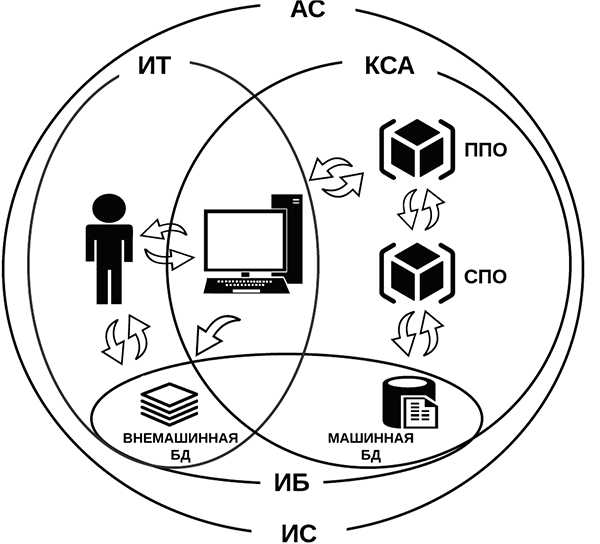
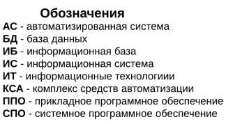
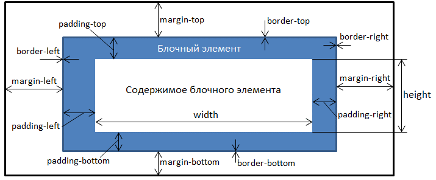

## Целыковский А.М. ИДМ-19-02
Страница с лабораторными по интернет-технологиям
* [Github профиль](https://github.com/alexitsl)
* [Репозиторий](https://github.com/alexitsl/Lab-Report)
* [Отчет](https://alexitsl.github.io/Lab-Report)

### Дополнительные полезности
* [inet-2019](https://github.com/stankin/inet-2019)
* [Список группы (wiki)](https://github.com/stankin/inet-2019/wiki/ИДМ_19_02)
* [Кондуит](https://docs.google.com/spreadsheets/d/1YBfCBfGZrUc5XJoWlb0x65fSch9kpcsCB17mJ0z-89s/edit#gid=1327184368)

### Проектик
* [Сайт проект - «CoTe» Formatting](https://alexitsl.github.io/Lab-Report/Project)
* [Сайт презентация проекта и команды - «RUINЪ»](https://alexitsl.github.io/Lab-Report/Presentation)

### Первый репозиторий
<br/>


### Подготовка к экзамену
### Билет 4
#### 1)Понятия информации, информационных технологий, информационных систем. Обязанности оператора информационной системы.
Существует много различных определений термина «информация». В Федеральном закон Российской Федерации от 27 июля 2006 г. N 149-ФЗ «Об информации, информационных технологиях и о защите информации» приведено точное определение данного термина, которого следует придерживаться: 
>* **Информация** - сведения (сообщения, данные) независимо от формы их представления.

Так же там приведены следующие важные определения: 
>* **Информационные технологии(ИТ)** - процессы, методы поиска, сбора, хранения, обработки, предоставления, распространения информации и способы осуществления таких процессов и методов;
>* **Информационная система(ИС)** - совокупность содержащейся в базах данных информации и обеспечивающих ее обработку информационных технологий и технических средств.

<br/>
Рис. Общая схема автоматизированной системы и ее составляющих.<br/>


Классифицировать информационные системы достаточно сложно из-за их разнообразия и постоянного развития структур и функций.

В качестве признаков классификации используются такие как: 
* область применения;
* охватываемая территория;
* организация информационных процессов;
* направление деятельности;
* структура и др.

Основными признаками следует считать разделение информационных систем по территориальному признаку и по сфере применения.

По территориальному признаку автоматизированная информационная система (АИС) классифицируются на геоинформационные, международные, общегосударственные, областные, республиканские, окружные, городские, районные и т.д.<br/>
По сфере применения различают АИС в экономике, в промышленности, в торговле, на транспорте, в правовой сфере, в медицине, в учебных заведениях и т.п.

Информационные технологии следует классифицировать прежде всего по области применения. Различают такие области применения информационных технологий, как наука, образование, культура, экономика, производство, военное дело и т. п.<br/>
Все в том же ФЗ «Об информации, информационных технологиях и о защите информации» (с.2.) дается следующее определение: 
>* **Оператор информационной системы** – гражданин или юридическое лицо, осуществляющие деятельность по эксплуатации информационной системы, в том числе по обработке информации, содержащейся в ее базах данных.

Также там приведены (с.12.1.) следующие обязанности оператора информационной системы:
>* Если иное не установлено федеральными законами, оператором информационной системы является собственник используемых для обработки содержащейся в базах данных информации технических средств, который правомерно пользуется такими базами данных, или лицо, с которым этот собственник заключил договор об эксплуатации информационной системы. В случаях и в порядке, установленных федеральными законами, оператор информационной системы должен обеспечить возможность размещения информации в сети «Интернет»  в форме открытых данных.

#### 2)Язык разметки HTML. Блочные и строчные элементы. Создание и управление стилями.

HTML (от англ. HyperText Markup Language — «язык гипертекстовой разметки») – стандартизированный язык разметки документов во Всемирной паутине, а также вся система верстки, которая определяет, как и какие элементы должны располагаться на веб-странице. Язык HTML интерпретируется браузерами; полученный в результате интерпретации форматированный текст отображается на экране монитора компьютера или мобильного устройства.

HTML-документ – это обычный текстовый документ, имеющий расширение .html. HTML-документ состоит из дерева HTML-элементов и текста. Каждый элемент обозначается в исходном документе начальным (открывающим) и конечным (закрывающим) тегом (за редким исключением).

Выделяют две основные категории HTML-элементов, которые соответствуют типам их содержимого и поведению в структуре веб-страницы – блочные и строчные элементы. С помощью блочных элементов можно создавать структуру веб-страницы, строчные элементы используются для форматирования текстовых фрагментов (за исключением элементов <area> и ).

Шаблон html-страницы:
```html
<html>
<head>
<meta charset="кодировка">
<title>название</title>
</head>
<body>
Здравствуйте, это моя первая
страница.
</body>
</html>
```

Разделение элементов на блочные и строчные используется в спецификации HTML до версии 4.01. В HTML5 эти понятия заменены более сложным набором категорий контента, согласно которым каждый HTML-элемент должен следовать правилам, определяющим, какой контент для него допустим. 

**Блочные элементы (block)**

В блочной модели элемент рассматривается как прямоугольный контейнер, имеющий область содержимого, необязательные рамки и отступы внутренние и внешние).

<br/>
Рис. Блочный элемент.

Блочные элементы – элементы высшего уровня, которые форматируются визуально как блоки, располагаясь на странице в окне браузера вертикально. Блочные элементы: 
```html
<address>, <article>, <aside>,
<blockquote>,
<dd>, <div>, <dl>, <dt>, <details>,
<fieldset>, <figcaption>, <figure>, <footer>, <form>,
<h1>-<h6>, <header>, <hr>,
<li>, <legend>,
<nav>, <noscript>,
<ol>, <output>, <optgroup>, <option>,
<p>, <pre>,
<section>, <summary>,
<table>,
<ul>
```
**Строчные элементы (inline)**

Встроенные (строчные) элементы генерируют внутристрочные контейнеры. Они не формируют новые блоки контента. Строчные элементы являются потомками блочных элементов. Ширина и высота строчного элемента зависит только от его содержимого.

Строчные элементы:
```html
<a>, <area>,
<b>, <bdo>, <bdi>,
<cite>, <code>,
<dfn>, <del>,
<em>,
<i>, <iframe>, , <ins>,
<kbd>,
<label>,
<map>, <mark>,
<s>, <samp>, <small>, <span>, <strong>, <sub>, <sup>,
<time>,
<q>,
<ruby>,
<u>,
<var>
```

В создании стилей можно выделить 3 основных подхода:
* встроенный;
* внутренний;
* внешний.

Наиболее распространенным подходом является внешний, который заключается в создании отдельного CSS файла для сохранения стилей и последующем подключении этого файла к основному Html-документу.

Если говорить конкретно о создании стилей в Html-документе, то рассматриваются два подхода: встроенный и внутренний.

**Встроенный CSS**<br/>
Встроенный CSS используется для применения уникального стиля к одному элементу HTML.<br/>
Встроенный CSS использует атрибут style элемента HTML.
```html
<h1 style="color:blue;">This is a Blue Heading</h1>
```

**Внутренняя CSS**<br/>
Внутренний CSS используется для определения стиля для одной HTML-страницы.<br/>
Внутренняя таблица CSS определена в разделе <head> HTML-страницы в элементе <style>.
```html
<!DOCTYPE html>
<html>
<head>
<style>
body {background-color: powderblue;}
h1   {color: blue;}
p    {color: red;}
</style>
</head>
<body>

<h1>This is a heading</h1>
<p>This is a paragraph.</p>

</body>
</html>
```
